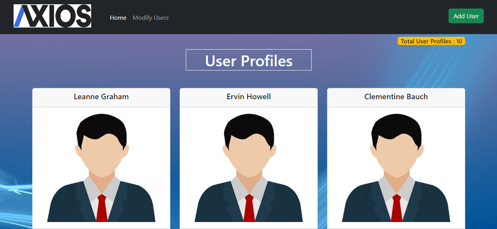

# React-Axios-Task

This is an sample user management website which is based on React-Axios which was designed by me using React. It's Guvi-Zen class Roadmap session: Day-30 and React : Day-10 Task.

## Tech Stack

- HTML
- CSS
- Javascript
- Bootstrap
- React(axios, react-router-dom)

## Features

- Responsive and Interactive Design
- You can do CRUD operations in this website.

## Lessons Learned

<b>Creating My Own Mock API</b>: 
- https://mockapi.io/ --> Through this website I created my own api which was used by me in this task.
- My User API : https://65d5835b3f1ab8c63437249d.mockapi.io/api/UserData
  
<b>Using Axios</b>: 
	- I learned to do CRUD operations using axios third party library which gave me wide exposure about APIs.
 

## Website

[React-Axios-Task]()

## Screenshots

## React + Vite

This template provides a minimal setup to get React working in Vite with HMR and some ESLint rules.

Currently, two official plugins are available:

- [@vitejs/plugin-react](https://github.com/vitejs/vite-plugin-react/blob/main/packages/plugin-react/README.md) uses [Babel](https://babeljs.io/) for Fast Refresh
- [@vitejs/plugin-react-swc](https://github.com/vitejs/vite-plugin-react-swc) uses [SWC](https://swc.rs/) for Fast Refresh

## Setup

Followig are the requirements to run this project:
- vite --> React Project Build Tool
- Node Package Manager (NPM)
- React

## npm run dev

Runs the app in the development mode.\
Open [http://localhost:5173](http://localhost:5173) to view it in your browser.

The page will reload when you make changes.\
You may also see any lint errors in the console.

## Feedback

If you have any feedback, please reach out to me at vijaymayhul@gmail.com

